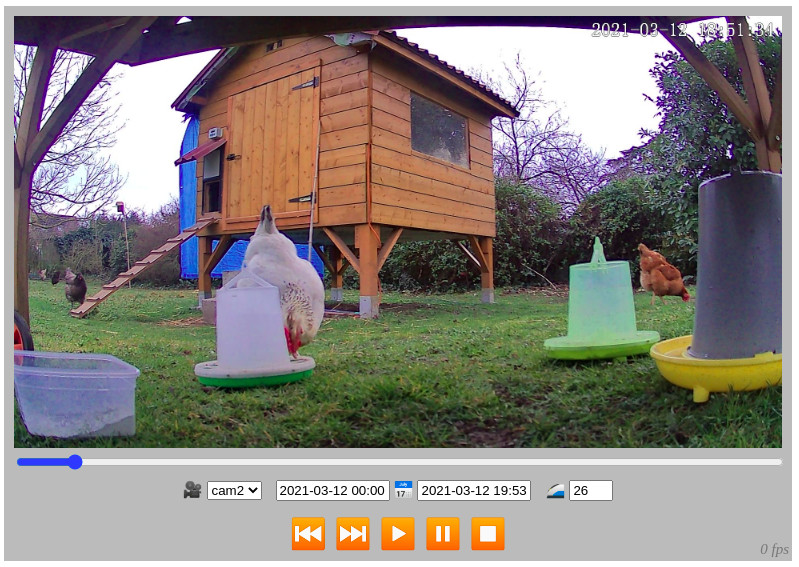
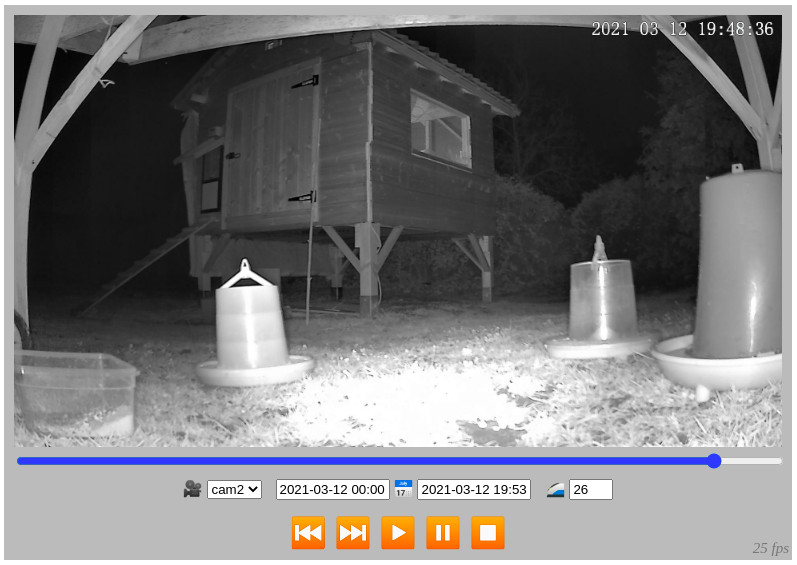

# cam-records-viewer

See docker-compose.yml ; Viewer for cam-recorder

Works with https://github.com/gallofeliz/cam-recorder.git ; Uses thumb while reading like "timelapse" and show best quality when pause (optimised)

